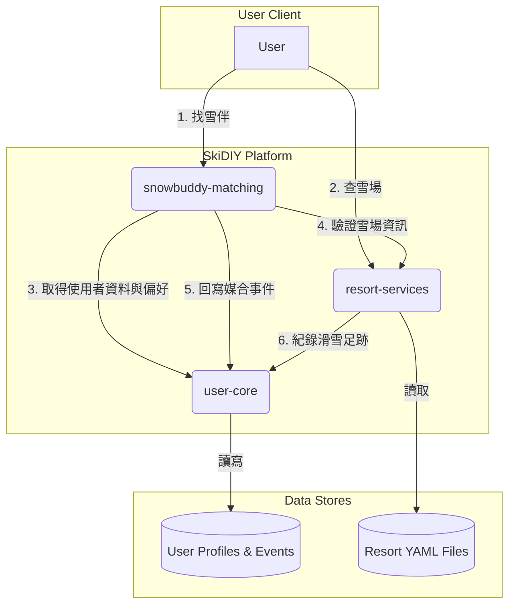

# SkiDIY 平台專案總覽 (SkiDIY Platform Project Overview)

這份文件旨在提供 SkiDIY 平台所有子專案的技術性總覽，包含整體架構、各專案的目標、目前開發進度、主要 API 端點與核心資料實體。

## 1. 總體架構 (Overall Architecture)

本平台採用**微服務架構**，將複雜的業務邏輯拆分成多個獨立、可獨立部署的服務。所有服務圍繞著一個核心的 `user-core` 服務，該服務是使用者資料與行為事件的唯一權威來源 (Single Source of Truth)。

---

## 2. 專案開發階段總結 (Project Development Stage Summary)

| 專案 Key | 專案名稱 | 目前狀態 | 備註 |
| :--- | :--- | :--- | :--- |
| `user-core` | 使用者核心服務 | ✅ **核心功能已實現** | 功能完備，可支撐其他服務。 |
| `resort-services` | 雪場資訊服務 | ✅ **核心功能已實現** | API 功能完整，並已完成與 `user-core` 的整合。 |
| `snowbuddy-matching` | 雪伴媒合服務 | 🟡 **框架已搭建，開發中** | 非同步框架與外部 API 串接已完成，核心演算法開發中。 |
| `coach-scheduling` | 教練排課服務 | 🔵 **僅有規格，尚未開發** | 藍圖已設計完成，等待下一階段啟動。 |
| `gear-ops` | 裝備營運服務 | 🔵 **僅有規格，尚未開發** | 藍圖已設計完成，等待下一階段啟動。 |
| `knowledge-engagement` | 知識互動服務 | 🔵 **僅有規格，尚未開發** | 藍圖已設計完成，等待下一階段啟動。 |

---

## 3. 各專案詳細說明 (Detailed Project Descriptions)

### `user-core`
- **目標**: 作為平台核心，可靠地維護使用者身份、角色、偏好，並統一記錄所有服務的行為事件。
- **目前狀態**: ✅ **核心功能已實現**
- **主要 API 端點**:
  - `GET /users`: 查詢使用者列表。
  - `POST /users`: 建立新使用者。
  - `GET /users/{user_id}`: 獲取單一使用者詳細資料。
  - `PUT /users/{user_id}`: 更新使用者資料。
  - `DELETE /users/{user_id}`: 停用使用者。
  - `POST /events`: 寫入一個新的行為事件。
  - `GET /events/by-user/{user_id}`: 根據使用者 ID 查詢其行為事件歷史。
  - `GET /users/{user_id}/preferences`: 獲取指定使用者的通知偏好。
  - `PUT /users/{user_id}/preferences`: 更新(Upsert)指定使用者的通知偏好。
- **核心資料實體**:
  - `UserProfile`: 使用者主檔。
  - `UserLocaleProfile`: 使用者地區性身份資訊。
  - `BehaviorEvent`: 標準化的行為事件紀錄。
  - `NotificationPreference`: 使用者對不同主題的通知授權設定。

### `resort-services`
- **目標**: 成為平台所有雪場資訊的權威來源，並提供地理位置相關的服務。
- **目前狀態**: ✅ **核心功能已實現**
- **主要 API 端點**:
  - `GET /resorts`: 查詢雪場列表，支援分頁、關鍵字搜尋與多條件篩選。
  - `GET /resorts/{resort_id}`: 獲取單一雪場的完整詳細資料。
  - `POST /users/{user_id}/ski-history`: 新增一筆滑雪足跡紀錄 (此 API 會在內部呼叫 `user-core` 的 `/events` API)。
  - `GET /resorts/{resort_id}/share-card`: 動態生成用於社群分享的個人化圖卡。
- **核心資料實體**:
  - `Resort`: 完整的雪場資料模型，從 YAML 檔案載入。
  - `ResortSummary`: 雪場的摘要資訊，用於列表頁。
  - `SkiHistoryCreate`: 用於接收滑雪紀錄請求的資料模型。

### `snowbuddy-matching`
- **目標**: 建立一個智慧、友善的雪伴媒合引擎，為使用者找到最適合的滑雪夥伴。
- **目前狀態**: 🟡 **框架已搭建，開發中**
- **主要 API 端點**:
  - `POST /matching/searches`: 發起一次非同步的雪伴搜尋任務。
  - `GET /matching/searches/{search_id}`: 查詢特定搜尋任務的狀態與結果。
  - `POST /requests`: 向目標使用者發送一個媒合請求。
  - `PUT /requests/{request_id}`: 回應 (接受/拒絕) 一個收到的媒合請求。
- **核心資料實體**:
  - `MatchingPreference`: 使用者的媒合偏好設定。
  - `CandidateProfile`: 用於內部計算的候選人資料。
  - `MatchSummary`: 包含匹配分數的媒合結果。

### `coach-scheduling`
- **目標**: 管理教練的空堂時段與學生的課程預約流程。
- **目前狀態**: 🔵 **僅有規格，尚未開發**
- **主要 API 端點**: N/A (尚未實現)
- **核心資料實體 (規劃中)**:
  - `ScheduleSlot`: 教練的空堂時段。
  - `Booking`: 學生的預約記錄。
  - `CalendarSync`: 外部行事曆同步資訊。

### `gear-ops`
- **目標**: 提供裝備檢查、保養提醒與二手雪具買賣的平台。
- **目前狀態**: 🔵 **僅有規格，尚未開發**
- **主要 API 端點**: N/A (尚未實現)
- **核心資料實體 (規劃中)**:
  - `GearItem`: 裝備主檔。
  - `GearInspection`: 裝備檢查記錄。
  - `GearListing`: 買賣刊登資訊。
  - `GearTrade`: 買賣交易紀錄。

### `knowledge-engagement`
- **目標**: 透過知識測驗與技能評分，激勵使用者學習與成長。
- **目前狀態**: 🔵 **僅有規格，尚未開發**
- **主要 API 端點**: N/A (尚未實現)
- **核心資料實體 (規劃中)**:
  - `QuizQuestion`: 題庫題目。
  - `QuizSession`: 測驗會話紀錄。
  - `SkillProfile`: 使用者技能評分。
  - `PracticeAssignment`: 教練指派的練習任務。
