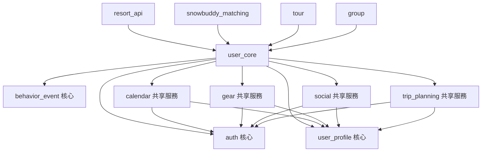

# user_core 結構分析

## T1.4: 目錄結構檢查

### 主要目錄結構
```
platform/user_core/
├── api/                    # API 端點層
│   ├── auth.py            # 認證端點 (核心)
│   ├── user_profiles.py   # 用戶資料端點 (核心)
│   ├── behavior_events.py # 行為事件端點 (核心)
│   ├── calendar.py        # 行事曆端點 (共享服務)
│   ├── gear.py           # 裝備管理端點 (共享服務)
│   ├── social.py         # 社交功能端點 (共享服務)
│   ├── trip_planning.py  # 行程規劃端點 (共享服務)
│   └── main.py           # FastAPI 應用主檔案
├── services/              # 業務邏輯層
│   ├── auth_service.py   # 認證服務 (核心)
│   ├── user_profile_service.py # 用戶資料服務 (核心)
│   ├── behavior_event_service.py # 行為事件服務 (核心)
│   ├── calendar_service.py # 行事曆服務 (共享服務)
│   ├── gear_service.py   # 裝備管理服務 (共享服務)
│   ├── social_service.py # 社交功能服務 (共享服務)
│   └── trip_service.py   # 行程服務 (共享服務)
├── models/               # 資料模型層
│   ├── user_profile.py   # 用戶資料模型 (核心)
│   ├── behavior_event.py # 行為事件模型 (核心)
│   ├── calendar.py       # 行事曆模型 (共享服務)
│   ├── gear.py          # 裝備模型 (共享服務)
│   ├── social.py        # 社交模型 (共享服務)
│   └── trip_planning.py # 行程規劃模型 (共享服務)
├── repositories/         # 資料存取層
├── schemas/             # API Schema 定義
└── config/              # 配置管理
```

## T1.5: 核心職責 vs 共享基礎設施識別

### 🔵 核心職責 (應保留在 user_core)
1. **認證授權 (auth)**
   - 檔案: `api/auth.py`, `services/auth_service.py`
   - 職責: 用戶註冊、登入、Token 驗證
   - 理由: 所有服務都依賴的核心功能

2. **用戶資料管理 (user_profile)**
   - 檔案: `api/user_profiles.py`, `services/user_profile_service.py`, `models/user_profile.py`
   - 職責: 用戶基本資料、偏好設定
   - 理由: 用戶身份的單一真實來源

3. **行為事件追蹤 (behavior_event)**
   - 檔案: `api/behavior_events.py`, `services/behavior_event_service.py`, `models/behavior_event.py`
   - 職責: 跨服務行為事件收集和分析
   - 理由: 需要統一收集所有服務的行為數據

### 🟡 共享基礎設施 (應拆分為獨立服務)
1. **行事曆服務 (calendar)**
   - 檔案: `api/calendar.py`, `services/calendar_service.py`, `models/calendar.py`
   - 職責: 行事曆事件管理、提醒
   - 拆分理由: 多個服務需要行事曆功能 (trip, gear, social)

2. **裝備管理服務 (gear)**
   - 檔案: `api/gear.py`, `services/gear_service.py`, `models/gear.py`
   - 職責: 裝備 CRUD、檢查提醒、二手市場
   - 拆分理由: 獨立的業務領域，可獨立擴展

3. **社交功能服務 (social)**
   - 檔案: `api/social.py`, `services/social_service.py`, `models/social.py`
   - 職責: 關注、動態消息、互動
   - 拆分理由: 複雜的社交邏輯，應獨立管理

4. **行程規劃服務 (trip_planning)**
   - 檔案: `api/trip_planning.py`, `services/trip_service.py`, `models/trip_planning.py`
   - 職責: 社交行程管理 (vs tour 的個人行程)
   - 拆分理由: 與 tour 服務功能重疊，需要整合

## T1.6: 依賴關係圖



### 依賴關係分析
- **所有共享服務都依賴核心服務** (auth, user_profile)
- **外部服務依賴 user_core** 進行認證和用戶資料
- **共享服務間有交叉依賴** (如 social 需要 calendar, gear 需要 calendar)

## T1.7: 服務邊界定義

### 重構後的目標架構
```yaml
核心服務 (保留在 user_core):
  auth:
    - 用戶註冊、登入
    - Token 生成和驗證
    - 密碼管理
  user_profile:
    - 用戶基本資料
    - 偏好設定
    - 技能等級
  behavior_event:
    - 跨服務事件收集
    - 行為分析
    - 統計數據

獨立共享服務:
  calendar-service:
    - 事件 CRUD
    - 提醒管理
    - 時間衝突檢查
  gear-service:
    - 裝備管理
    - 檢查提醒
    - 二手市場
  social-service:
    - 關注系統
    - 動態消息
    - 社交互動
```

### 拆分優先級
1. **P1 (最高)**: calendar-service - 被多個服務依賴
2. **P2 (高)**: gear-service - 獨立業務領域
3. **P3 (中)**: social-service - 複雜但相對獨立
4. **P4 (低)**: trip_planning - 需要與 tour 整合分析

## 下一步行動
- ✅ T1.4: 目錄結構分析完成
- ✅ T1.5: 職責邊界識別完成  
- ✅ T1.6: 依賴關係圖完成
- ✅ T1.7: 服務邊界定義完成
- 🎯 **下一步**: 開始 Phase 1.3 - Calendar Service 拆分 (T1.8)
