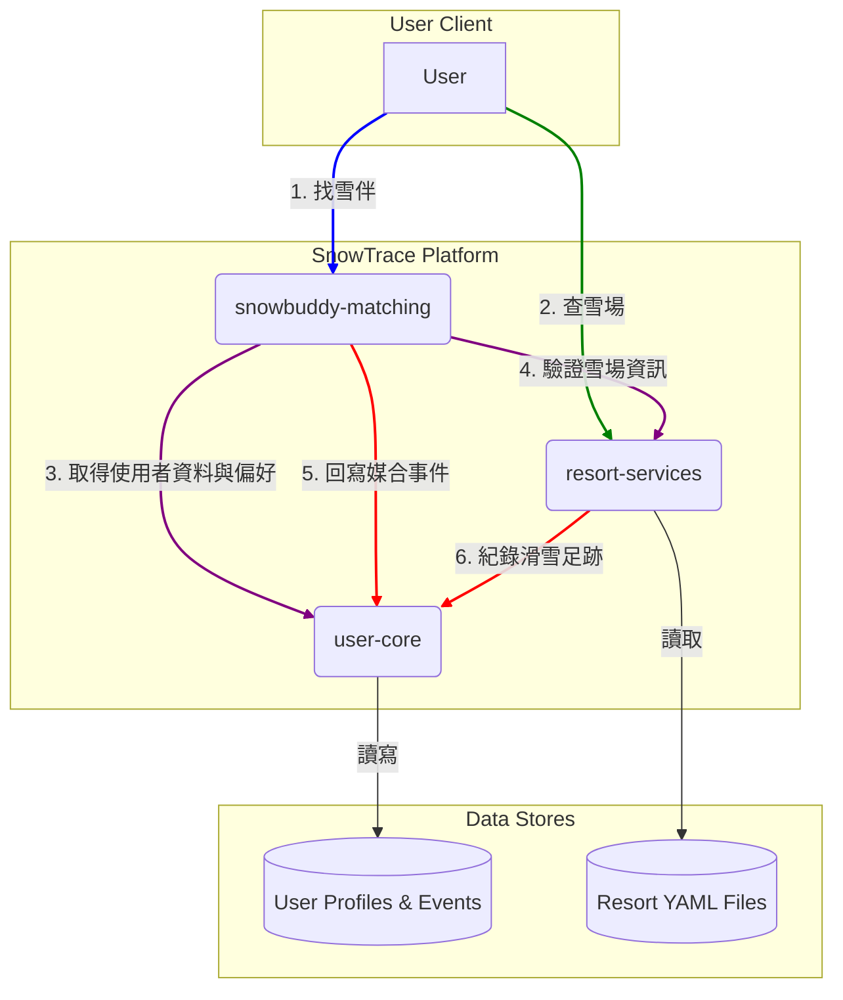
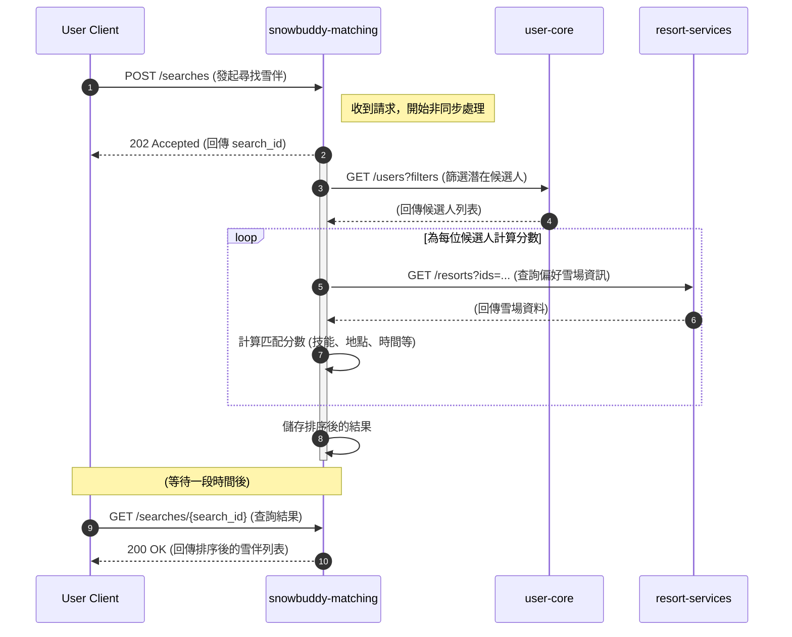

### 圖表說明

這個架構圖展示了三個核心服務的互動關係：

1.  **`user-core` (紅色)**: 作為平台的核心，負責管理所有使用者資料、偏好設定以及統一的行為事件紀錄。它是所有其他服務的資料基礎。

2.  **`resort-services` (綠色)**: 負責管理所有雪場的靜態資料。它從我們建立的 YAML 檔案中讀取資料，並透過 API 提供給前端或其他服務 (如 `snowbuddy-matching`) 查詢。當使用者紀錄滑雪足跡時，它會通知 `user-core`。

3.  **`snowbuddy-matching` (紫色)**: 負責執行媒合邏輯。它會從 `user-core` 獲取使用者資訊，從 `resort-services` 獲取地點資訊，運算後回傳結果，並將媒合過程中的重要事件 (如發送邀請、接受邀請) 紀錄回 `user-core`。

使用者 (User Client) 的請求會根據功能，分別發送至 `snowbuddy-matching` 或 `resort-services`。

---

## 媒合流程順序圖 (Sequence Diagram)

### 圖表說明

這個循序圖詳細展示了「尋找雪伴」功能背後的 API 互動流程：

1.  **發起搜尋**: 使用者 (User Client) 向 `snowbuddy-matching` 服務發起一個 `POST` 請求來開始搜尋。
2.  **非同步處理**: `snowbuddy-matching` 服務立即回覆一個 `202 Accepted`，表示請求已收到並在背景開始處理，同時提供一個 `search_id` 供後續查詢。
3.  **獲取候選人**: `snowbuddy-matching` 服務向 `user-core` 服務請求一份符合基本條件的使用者列表。
4.  **計算分數 (迴圈)**:
    - 對於每一位潛在的候選人，`snowbuddy-matching` 服務可能會需要向 `resort-services` 查詢他們偏好雪場的詳細資料，以進行更精準的地點計分。
    - 服務內部綜合各項偏好（技能、地點、時間等）計算出一個最終的匹配分數。
5.  **儲存結果**: 所有候選人計算完畢後，`snowbuddy-matching` 將排序好的結果暫存起來。
6.  **獲取結果**: 使用者端在發起搜尋一段時間後，使用之前收到的 `search_id` 向 `snowbuddy-matching` 服務發起 `GET` 請求，以獲取最終的雪伴推薦列表。

這個非同步的設計確保了即使在進行複雜且耗時的媒合運算時，使用者介面也不會被卡住，提升了整體的使用者體驗。